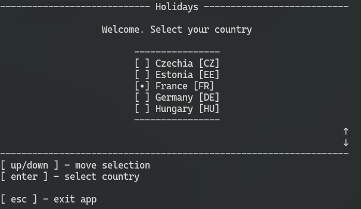

# Upcoming-Holidays
A simple C# console app that queries and displays the upcoming holidays for your country. Powered by https://www.openholidaysapi.org/

# Features
- Friendly command line interface controlled with keyboard
- Fresh data downloaded from the API
- A lot of countries supported
- Names translation

## Installation ##
To simply install and use the app, go to the [**Releases**](https://github.com/creeper82/Upcoming-holidays/releases) section and install a compressed folder with the newest release. Unpack the zip file

The folder contains .dll libraries and an executable file (**Upcoming-holidays.exe** if you're on Windows). You should run the executable file

There is no automatic installer yet. Just put the app folder into any location, and add a shortcut to the .exe file on your desktop. This way, you will have an easy access to the app.

The app is self-contained, meaning there should theoretically be no need to install anything additionally, but tell me if it doesn't work on your device.

**Please use [Windows Terminal](https://apps.microsoft.com/detail/9N0DX20HK701)** for this app (or just set it as default terminal), if you want a smooth console experience with no visible lags. This applies to pre-Windows 11 users, as Windows Terminal is not installed yet by default

### Linux note ###
There is a release build for Linux. It should work (permit execution and execute the Upcoming-holidays file), but I prefer to focus on the Windows version

## Screenshots ##

### Home screen ###

### Holidays ###

Native language

---

Translated to english

## Built with ##
This app was built using C# with [Microsoft .NET 8.0.4](https://dotnet.microsoft.com/en-us/download)

## Documentation ##
You can find app usage instructions in the help menu. The app is rather intuitive to use, just follow the on-screen messages and possible options

CLI is basically the same as in my [Flashcards project](https://github.com/creeper82/Flashcards). You may browse its' folders, if you want to read the CLI documentation.
